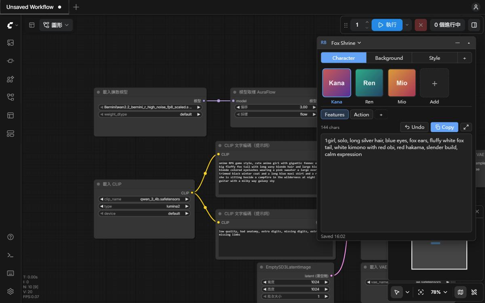

# ComfyUI-RefBook

A small floating panel in ComfyUI that keeps your project's characters, backgrounds and styles in one place. Each one has a picture and its prompts, ready to copy.



## Why

When you work on one IP over a long time (training LoRAs, making assets, generating story scenes), the same character descriptions, backgrounds and style prompts get reused again and again. Prompt nodes live inside a single workflow and disappear when you switch workflows. RefBook stays on screen no matter which workflow is open, so your project's reference prompts are always one click away.

## Install

```bash
cd ComfyUI/custom_nodes
git clone https://github.com/yixuanzona/ComfyUI-RefBook.git
```

Restart ComfyUI. No extra Python packages are needed.

## How to use

1. Click the **RB** bar at the top right (or press **Alt+P**) to open the panel. Click the bar again to collapse it. Drag the bar to move it.
2. Pick a **section** (Character / Background / Style).
3. Pick an **item** from the row of pictures, for example a character.
4. Pick a **prompt group** (Features / Action) and its prompt shows in the big box.
5. Click **Copy** and paste the prompt into your workflow.

Each row ends with **＋** to add something new. Hover over any name to see **✎** (rename) and **✕** (delete).

## Features

- **Always on screen.** A floating panel, not a node, so it never gets lost in a workflow. Typing or scrolling in the panel never affects the canvas.
- **Projects.** One project per IP. Duplicate a project to keep separate stages, such as "Kana" and "Kana · Final".
- **Pictures.** Drag an image onto a card, paste it with **Ctrl+V**, or click 🖼. Click the selected card to view it full size.
- **Edit in place.** Type straight into the prompt box. Everything saves automatically.
- **Undo.** **Undo** steps back through your prompt edits. Deleted items can be restored with the **Undo** link at the bottom for 8 seconds.
- **Large editor.** **⤢** opens a big window for long prompts.
- **Drag to reorder** sections, cards and groups. Drop a card on another section to move it.
- **Safe storage.** Plain files, a backup before every save (last 20 kept), and a trash folder for deleted items.

The default group names for new items can be changed in **ComfyUI Settings → RefBook**.

## Where your data is

```
ComfyUI/user/default/ref_book/
  projects/   one JSON file per project
  images/     pictures
  thumbs/     small previews (rebuilt automatically)
  .backups/   automatic backups
  .trash/     deleted items
```

To use the same data on another computer, copy this folder there. A setting to point RefBook at a synced folder (Dropbox, OneDrive, NAS, Git) is planned.

## License

MIT
